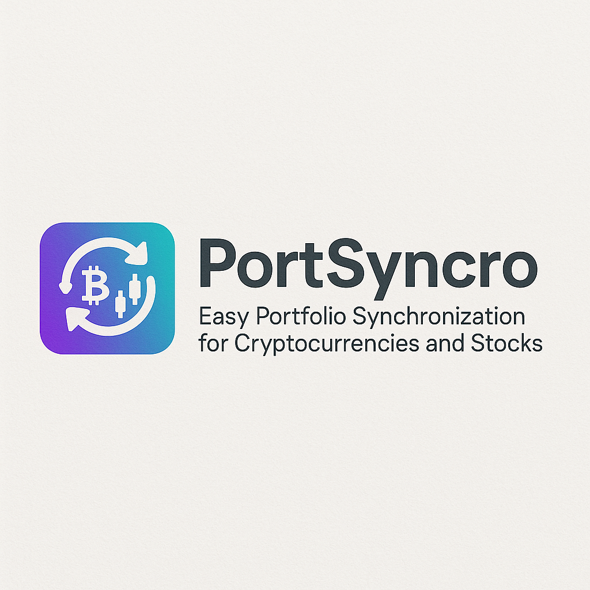
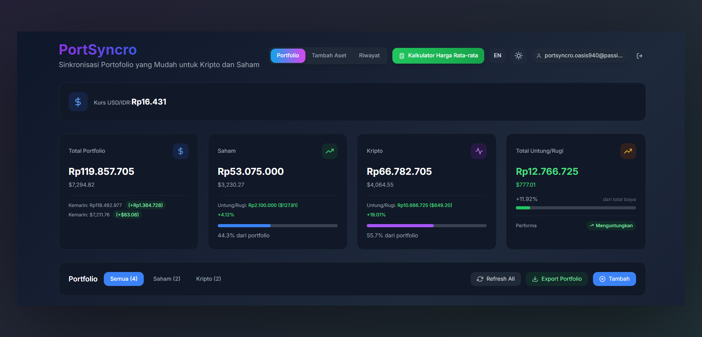
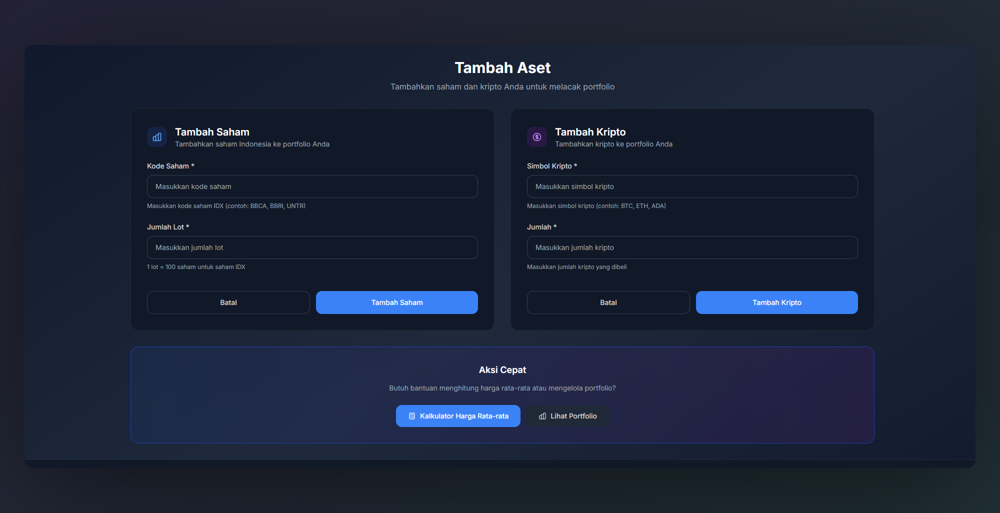
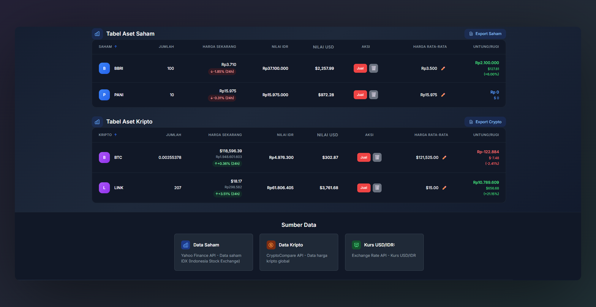
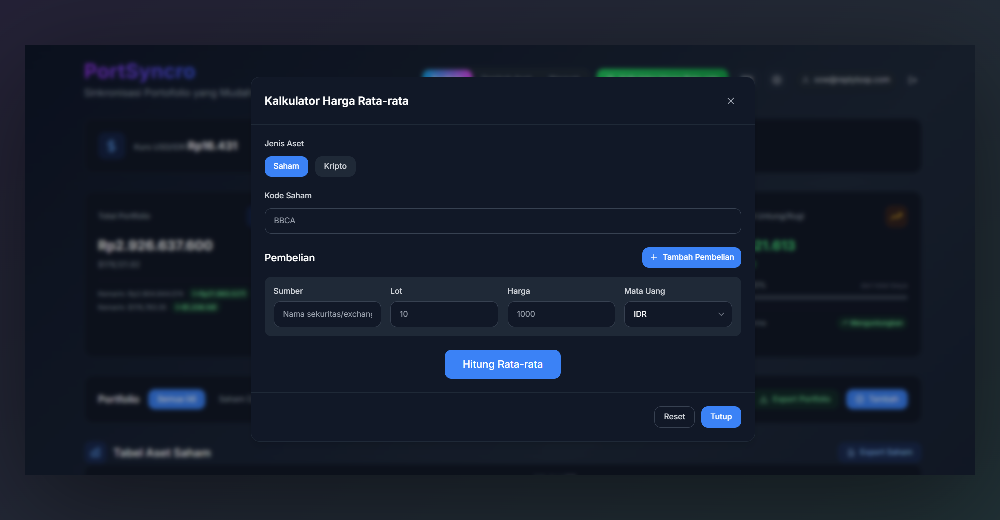
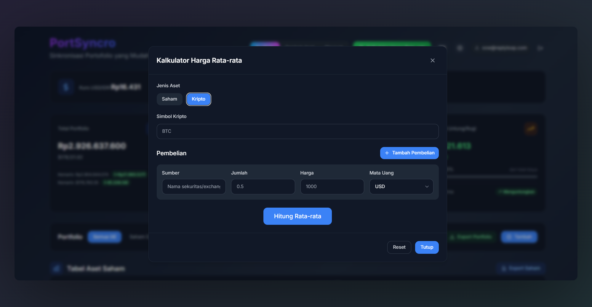
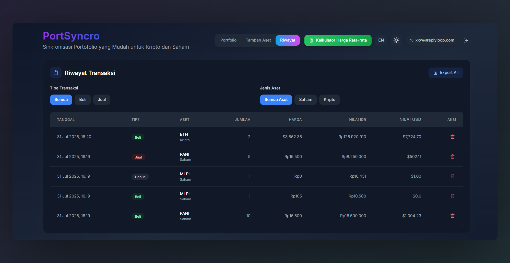
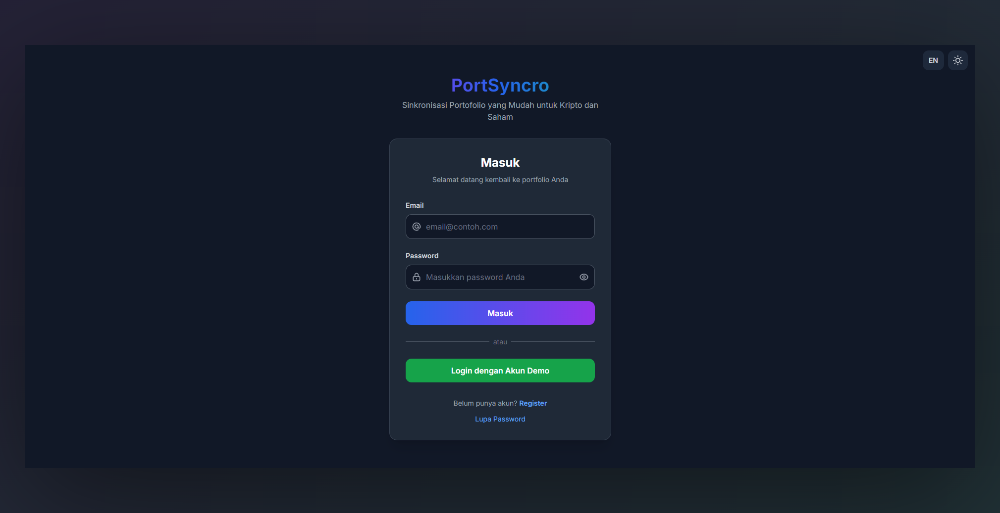

# PortSyncro - Portfolio Management App

A modern portfolio management application built with Next.js and Tailwind CSS, designed to track stocks and cryptocurrency investments with a beautiful Dribbble-inspired UI/UX.

**Easy Portfolio Synchronization for Cryptocurrencies and Stocks**

**Sinkronisasi Portofolio yang Mudah untuk Kripto dan Saham**



## 🚀 Features

- **Portfolio Management**: Track Indonesian stocks and cryptocurrency investments
- **Real-time Price Updates**: Get live prices for stocks and crypto
- **Exchange Rate Integration**: USD/IDR exchange rate tracking
- **Average Price Calculator**: Calculate weighted average prices for multiple purchases
- **Transaction History**: Keep track of all buy/sell transactions
- **Export Functionality**: Export portfolio data to CSV
- **Multi-language Support**: English and Indonesian with automatic tagline translation
- **Dark/Light Mode**: Toggle between themes
- **Responsive Design**: Works on desktop, tablet, and mobile
- **Beautiful UI/UX**: Dribbble-inspired design with smooth animations
- **Indonesian Market Focus**: Optimized for Indonesian Stock Exchange (IDX) stocks

## 📱 Application Screenshots

### Dashboard & Portfolio Overview


### Asset Management



### Average Price Calculator



### Transaction History


### Authentication


## 🛠️ Tech Stack

- **Frontend**: Next.js 15, React 18
- **Styling**: Tailwind CSS with custom Dribbble-inspired design system
- **Authentication**: Firebase Auth
- **Database**: Firebase Firestore
- **Icons**: React Icons
- **State Management**: React Context API
- **API**: Custom Next.js API routes

## 📦 Installation

1. Clone the repository:
```bash
git clone https://github.com/yourusername/PortSyncro.git
cd PortSyncro
```

2. Install dependencies:
```bash
npm install
```

3. Set up environment variables:
Create a `.env.local` file in the root directory:
```env
# Firebase Configuration (Required)
NEXT_PUBLIC_FIREBASE_API_KEY=your_firebase_api_key
NEXT_PUBLIC_FIREBASE_AUTH_DOMAIN=your_firebase_auth_domain
NEXT_PUBLIC_FIREBASE_PROJECT_ID=your_firebase_project_id
NEXT_PUBLIC_FIREBASE_STORAGE_BUCKET=your_firebase_storage_bucket
NEXT_PUBLIC_FIREBASE_MESSAGING_SENDER_ID=your_firebase_messaging_sender_id
NEXT_PUBLIC_FIREBASE_APP_ID=your_firebase_app_id

# Demo Account Credentials (Optional)
# These are used for the demo login feature
# If not provided, the demo login button will be hidden
NEXT_PUBLIC_DEMO_EMAIL=your_demo_email@example.com
NEXT_PUBLIC_DEMO_PASSWORD=your_demo_password
```

4. Run the development server:
```bash
npm run dev
```

5. Open [http://localhost:3000](http://localhost:3000) in your browser.

## 🆕 Recent Updates

### Tagline Localization (Latest)
- ✅ Fixed hardcoded tagline text across all pages
- ✅ Implemented automatic tagline translation
- ✅ Updated mobile view calculator button text
- ✅ Enhanced internationalization support

### Mobile Experience Improvements
- ✅ Calculator button now shows proper translated text on mobile
- ✅ Consistent tagline display across all screen sizes
- ✅ Improved responsive design for tagline elements

## 🚀 Demo Account Setup

PortSyncro includes a demo account feature that allows users to try the app without creating an account. To enable this feature:

### For Local Development
Add the demo account credentials to your `.env.local` file:
```env
NEXT_PUBLIC_DEMO_EMAIL=your_demo_email@example.com
NEXT_PUBLIC_DEMO_PASSWORD=your_demo_password
```

### For Production (Vercel)
1. Go to your Vercel project dashboard
2. Navigate to **Settings** → **Environment Variables**
3. Add the following environment variables:
   - `NEXT_PUBLIC_DEMO_EMAIL`: Your demo account email
   - `NEXT_PUBLIC_DEMO_PASSWORD`: Your demo account password
4. Redeploy your application

### Demo Account Behavior
- If demo credentials are configured, a "Login Demo Account" button will appear on login and register pages
- If demo credentials are not provided, the demo login button will be hidden
- Demo account allows users to explore all PortSyncro features with sample data
- Demo data is isolated and doesn't affect other users

## 🎨 Design System

PortSyncro uses **Tailwind CSS** with a custom Dribbble-inspired design system. The design system includes:

- **Custom Color Palette**: Primary, secondary, accent, success, warning, and error colors
- **Typography**: Inter font family with consistent sizing
- **Spacing**: Consistent spacing scale
- **Components**: Reusable component classes for buttons, inputs, cards, etc.
- **Animations**: Smooth transitions and micro-interactions
- **Dark Mode**: Full dark mode support with custom color schemes

### Design Features

- **Glass Morphism**: Subtle backdrop blur effects
- **Gradient Backgrounds**: Beautiful gradient combinations
- **Soft Shadows**: Layered shadow system for depth
- **Smooth Animations**: CSS transitions and keyframe animations
- **Responsive Design**: Mobile-first approach
- **Accessibility**: WCAG compliant components

### Color Palette

```css
/* Primary Colors */
primary: {
  50: '#f0f9ff',
  500: '#0ea5e9',
  900: '#0c4a6e',
}

/* Secondary Colors */
secondary: {
  50: '#fdf4ff',
  500: '#d946ef',
  900: '#701a75',
}

/* Accent Colors */
accent: {
  50: '#f0fdfa',
  500: '#14b8a6',
  900: '#134e4a',
}
```

## 📱 Components

### Core Components
- `Portfolio.js` - Main portfolio dashboard with Dribbble-inspired cards
- `AssetTable.js` - Asset listing and management
- `StockInput.js` - Stock addition form (Tailwind CSS)
- `CryptoInput.js` - Crypto addition form (Tailwind CSS)
- `Modal.js` - Reusable modal component (Tailwind CSS)
- `Notification.js` - Toast notifications (Tailwind CSS)
- `ThemeToggle.js` - Dark/light mode toggle (Tailwind CSS)
- `LanguageToggle.js` - Language switcher (Tailwind CSS)
- `AveragePriceCalculator.js` - Average price calculator tool (Tailwind CSS)

### Layout Components
- `ProtectedRoute.js` - Authentication wrapper
- `ErrorBoundary.js` - Error handling component

## 🔧 Configuration

### Tailwind CSS Setup
PortSyncro uses Tailwind CSS with a custom configuration:

```javascript
// tailwind.config.js
module.exports = {
  content: [
    './pages/**/*.{js,ts,jsx,tsx,mdx}',
    './components/**/*.{js,ts,jsx,tsx,mdx}',
    './lib/**/*.{js,ts,jsx,tsx,mdx}',
  ],
  darkMode: 'class',
  theme: {
    extend: {
      colors: {
        // Dribbble-inspired color palette
        primary: { /* custom primary colors */ },
        secondary: { /* custom secondary colors */ },
        // ... other color tokens
      },
      // ... other design tokens
    },
  },
  plugins: [
    require('@tailwindcss/forms'),
  ],
}
```

### API Routes
- `/api/prices` - Fetch stock and crypto prices
- `/api/hello` - Health check endpoint

## 📊 Features

### Portfolio Management
- Add Indonesian stocks (IDX market) with lot-based calculations
- Add cryptocurrencies with real-time pricing
- Track portfolio performance and gains/losses
- View portfolio allocation and percentages

### Price Tracking
- Real-time stock prices from Yahoo Finance
- Cryptocurrency prices from multiple sources
- USD/IDR exchange rate integration
- Automatic price refresh functionality

### Calculations
- **Average Price Calculator**: Calculate weighted average prices for multiple purchases with support for both stocks and crypto
- **Multi-language Calculator**: Calculator button text adapts to selected language (English/Indonesian)
- **Gain/Loss Calculations**: Calculations in both IDR and USD currencies
- **Portfolio Value Tracking**: Real-time updates with automatic refresh
- **Performance Metrics**: Comprehensive analytics and performance tracking

### Data Export
- CSV export functionality
- Portfolio data export
- Transaction history export

## 🌐 Internationalization

PortSyncro supports multiple languages with full localization:
- **English (en)**: Complete English interface
- **Indonesian (id)**: Complete Indonesian interface including "Sinkronisasi Portofolio yang Mudah untuk Kripto dan Saham"

### Tagline Localization
PortSyncro's tagline automatically adapts to the selected language:
- **English**: "Easy Portfolio Synchronization for Cryptocurrencies and Stocks"
- **Indonesian**: "Sinkronisasi Portofolio yang Mudah untuk Kripto dan Saham"

Language context is managed in `lib/languageContext.js` with automatic tagline translation across all pages.

## 🎯 Best Practices

### Tailwind CSS Usage
- Use semantic class combinations for consistent theming
- Leverage Tailwind's responsive design utilities
- Utilize dark mode classes for theme switching
- Follow component composition patterns

### Code Organization
- Components are organized by functionality
- Shared utilities in `lib/` directory
- API routes in `pages/api/`
- Consistent naming conventions

### Performance
- Lazy loading for heavy components
- Optimized bundle size with Tailwind CSS purging
- Efficient state management with React Context

## 🚀 Deployment

PortSyncro can be deployed to Vercel, Netlify, or any other Next.js-compatible platform.

### Vercel Deployment
1. Connect your GitHub repository to Vercel
2. Set environment variables in Vercel dashboard
3. Deploy automatically on push to main branch

## 🤝 Contributing

1. Fork the repository
2. Create a feature branch
3. Make your changes
4. Test thoroughly
5. Submit a pull request

## 📄 License

This project is licensed under the MIT License.

## 🔧 Troubleshooting

### Demo Login Issues

If you encounter `auth/invalid-credential` errors when using the demo login:

1. **Check Environment Variables**:
   ```bash
   npm run check-env
   ```
   This will verify if all required environment variables are set.

2. **Verify Demo Account Exists**:
   - Ensure the demo account email exists in your Firebase project
   - Check that the password matches the one in your environment variables
   - Verify the account is enabled in Firebase Authentication

3. **Local Development**:
   - Create a `.env.local` file in your project root
   - Add your Firebase configuration and demo credentials
   - Restart your development server

4. **Production Deployment**:
   - Check that environment variables are properly set in your deployment platform
   - Ensure variables are available to all environments
   - Redeploy after adding new environment variables

5. **Common Issues**:
   - **Environment variables not loaded**: Restart your development server
   - **Demo account not created**: Create the demo account in Firebase Authentication
   - **Wrong credentials**: Double-check email and password in environment variables
   - **Firebase project mismatch**: Ensure you're using the correct Firebase project

### Firebase Configuration Issues

If you're having trouble with Firebase authentication:

1. **Verify Firebase Config**: Check that all Firebase environment variables are correct
2. **Enable Authentication**: Ensure Email/Password authentication is enabled in Firebase
3. **Check Project ID**: Verify the project ID matches your Firebase project
4. **Domain Restrictions**: Check if your domain is allowed in Firebase Authentication settings

## 🔄 Migration from Chakra UI

PortSyncro has been completely migrated from Chakra UI to Tailwind CSS with a Dribbble-inspired design system. Key changes:

- Removed all Chakra UI dependencies
- Converted all components to use Tailwind CSS classes
- Implemented custom design system with Dribbble-inspired aesthetics
- Maintained responsive design and accessibility
- Preserved all functionality while improving visual appeal

### Benefits of Tailwind CSS Migration
- **Better Performance**: Smaller bundle size with purging
- **Custom Design System**: Full control over design tokens
- **Dribbble-Inspired UI**: Modern, beautiful interface
- **Better Developer Experience**: Intuitive utility classes
- **Flexibility**: Easy customization and theming
- **Performance**: Optimized CSS with purging

### Design Improvements
- **Glass Morphism Effects**: Subtle backdrop blur and transparency
- **Gradient Backgrounds**: Beautiful color combinations
- **Smooth Animations**: CSS transitions and micro-interactions
- **Better Typography**: Improved font hierarchy and spacing
- **Enhanced Cards**: Modern card designs with shadows and hover effects
- **Improved Buttons**: Gradient buttons with hover animations
